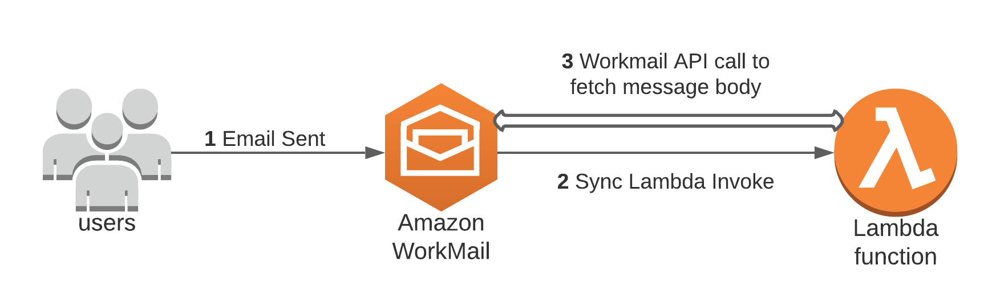
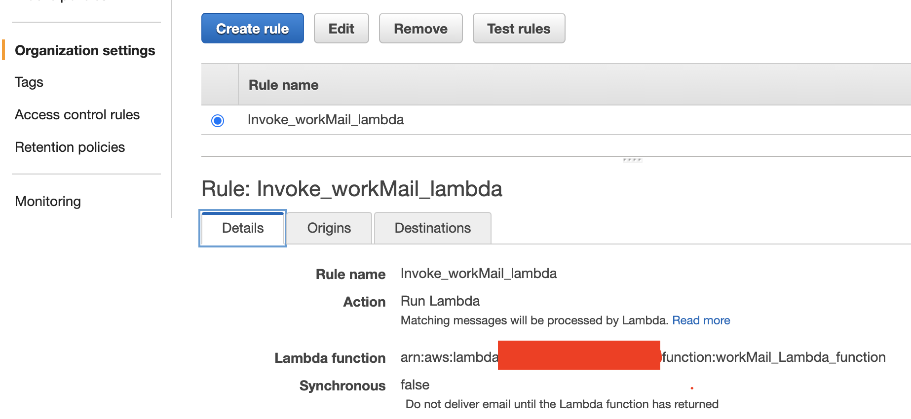
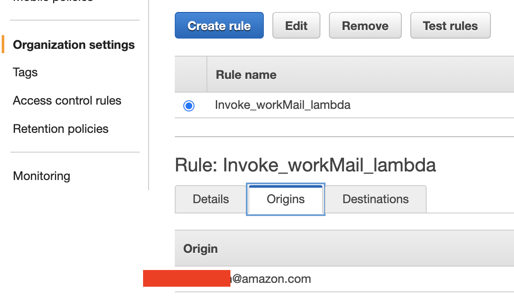
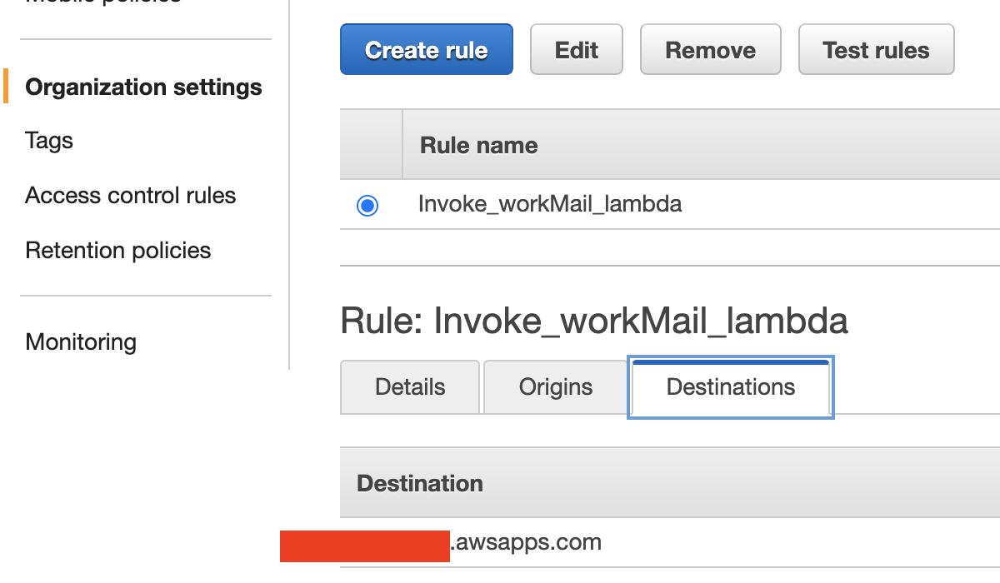

# Amazon Textract IDP CDK Constructs

<!--BEGIN STABILITY BANNER-->

---


> All classes are under active development and subject to non-backward compatible changes or removal in any
> future version. These are not subject to the [Semantic Versioning](https://semver.org/) model.
> This means that while you may use them, you may need to update your source code when upgrading to a newer version of this package.

---
<!--END STABILITY BANNER-->

# Context

This CDK Construct can be used as Step Function task and call Textract in Asynchonous mode for DetectText and AnalyzeDocument APIs.

For samples on usage, look at [Amazon Textact IDP CDK Stack Samples](https://github.com/aws-samples/amazon-textract-idp-cdk-stack-samples)

## Input


Expects a Manifest JSON at 'Payload'.
Manifest description: https://pypi.org/project/schadem-tidp-manifest/

Example call in Python

```python
        textract_async_task = t_async.TextractGenericAsyncSfnTask(
            self,
            "textract-async-task",
            s3_output_bucket=s3_output_bucket,
            s3_temp_output_prefix=s3_temp_output_prefix,
            integration_pattern=sfn.IntegrationPattern.WAIT_FOR_TASK_TOKEN,
            lambda_log_level="DEBUG",
            timeout=Duration.hours(24),
            input=sfn.TaskInput.from_object({
                "Token":
                sfn.JsonPath.task_token,
                "ExecutionId":
                sfn.JsonPath.string_at('$$.Execution.Id'),
                "Payload":
                sfn.JsonPath.entire_payload,
            }),
            result_path="$.textract_result")
```

#### Query Parameter

Example: 
```python

            input=sfn.TaskInput.from_object({
                "Token":
                sfn.JsonPath.task_token,
                "ExecutionId":
                sfn.JsonPath.string_at('$$.Execution.Id'),
                "Payload":
                sfn.JsonPath.entire_payload,
                "Query": [
                           {
                                'Text': 'string',
                                'Alias': 'string',
                                'Pages': [
                                    'string',
                                ]
                            },
                                {
                                "Text": "What is the name of the realestate company",
                                "Alias": "APP_COMPANY_NAME"
                            },
                            {
                                "Text": "What is the name of the applicant or the prospective tenant",
                                "Alias": "APP_APPLICANT_NAME"
                            },
                ]
            }),

```
Documentation: https://boto3.amazonaws.com/v1/documentation/api/latest/reference/services/textract/client/start_document_analysis.html

To add a query parameter to the Manifest JSON, we are going to leverage the 'convert_manifest_queries_config_to_caller'. It transforms a list of Query objects (as indicated by the type hint List[tm.Query]) into a QueriesConfig object (as indicated by the return type tc.QueriesConfig).

The function expects a list of Query objects as input. Each Query object should have the following attributes: 
- text (required)
- alias (opt)
- pages (opt)

The function creates a new QueriesConfig object. If the input list is not empty, it creates a list comprehension that generates a new Query object for each Query object in the input list, maintaining the same text, alias, and pages values. If the input list is empty, it simply creates a QueriesConfig object with an empty queries list.


## Output

Adds the "TextractTempOutputJsonPath" to the Step Function ResultPath. At this location the Textract output is stored as individual JSON files. Use the CDK Construct schadem-cdk-construct-sfn-textract-output-config-to-json to combine them to one single JSON file.

example with ResultPath = textract_result (like configured above):

```
"textract_result": {
    "TextractTempOutputJsonPath": "s3://schademcdkstackpaystuban-schademcdkidpstackpaystu-bt0j5wq0zftu/textract-temp-output/c6e141e8f4e93f68321c17dcbc6bf7291d0c8cdaeb4869758604c387ce91a480"
  }
```

## Spacy Classification

Expect a Spacy textcat model at the root of the directory. Call the script <TO_INSERT) to copy a public one which classifies Paystub and W2.

aws s3 cp s3://amazon-textract-public-content/constructs/en_textcat_demo-0.0.0.tar.gz .


### How to use Workmail Integration

In order to demonstrate this functionality, I have used below architecture where once the inbound email is delivered to your Amazon workmail inbox and if the pattern/s matches, it will invoke the rule action which is inovocation of a lambda function in this case. You can use my sample code to fetch the inbound email message body and parse it properly as text.




### Prerequisites

1. As I have used Python 3.6 as my Lambda function runtime hence some knowledge of python 3 version is required.

### Steps

1. First setup an Amazon workmail site, setup an organization and create a user access by following steps mentioned in 'Getting Started' document [here](https://docs.aws.amazon.com/workmail/latest/adminguide/howto-start.html). Once above setup process is done, you will have access to https://*your Organization*.awsapps.com/mail webmail url and you can login using your created user's username / password to access your emails.

2. Now we will create a lambda function which will be invoked once inbound email reaches the inbox and email flow rule pattern is matched (more on this in below steps). You can use the sample lambda python(3.6) code ( lambda_function.py) provided in the 'code' folder for the same. It will fetch the inbound email message body and then parse it properly to get the message body as text. Once you get it as text you can perform various operations on it.


3. Inbound email flow rules, also called rule actions, automatically apply to all email messages sent to anyone inside of the Amazon WorkMail organization. This differs from email rules for individual mailboxes. Now we will set up email flow rules to handle email flows based on email addresses or domains. Email flow rules are based on both the sender's and recipient's email addresses or domains.

To create an email flow rule, we need to specify a rule action to apply to an email when a specified pattern is matched. Follow the documenttion link [here](https://docs.aws.amazon.com/workmail/latest/adminguide/email-flows.html#email-flows-rule-actions) to create email flow rule for your organization which you created in step #1 above. you have to select Action=Run Lambda for your rule. Below is the email flow rule created by me:



you can now follow documentation link [here](https://docs.aws.amazon.com/workmail/latest/adminguide/email-flows.html#email-flows-patterns) to create pattern/s which need to be satisfied first in order to invoke the rule action (in this case it will invoke our lambda function). For this sample code functionality I have used my email address as pattern in 'origns' and my domain as pattern in 'destinations'. so in this case the lambda function will only be invoke if inbound email sender is my email address and destination is my domain only but you can set patterns as per your requirements. Below screen shots depicts my patterns:




